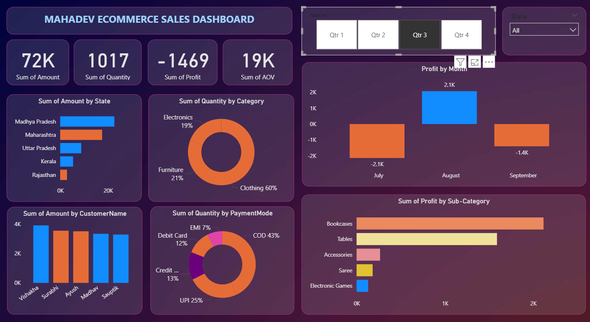

# Ecommerce Sales Dashboard

## Project Overview
This project presents an interactive **Ecommerce Sales Dashboard** built using Power BI to analyze sales performance, profitability, customer behavior, and payment preferences.  
The dashboard provides a clear overview of business metrics and helps identify trends, losses, and growth opportunities across different categories and regions.

---

## Objectives
- Track overall sales, quantity, and profit performance  
- Identify profit and loss trends by month  
- Analyze category and sub-category contribution  
- Understand customer purchasing behavior  
- Evaluate payment mode preferences  

---

## Dataset Description
The dataset contains transaction-level ecommerce sales data with the following fields:
- Order details (Order ID)  
- Sales metrics (Amount, Quantity, Profit)  
- Product details (Category, Sub-Category)  
- Customer information (Customer Name, State)  
- Payment modes (COD, UPI, Credit Card, Debit Card, EMI)  

---

## Key Performance Indicators (KPIs)
- Total Sales Amount  
- Total Quantity Sold  
- Total Profit  
- Average Order Value (AOV)  

---

## Dashboard Analysis

### Sales & Profit Analysis
- Monthly profit trends highlighting profit and loss periods  
- Identification of months with negative profitability  

### Category & Sub-Category Insights
- Quantity distribution across product categories  
- Profit contribution by sub-category  

### Regional Performance
- State-wise sales comparison  
- Identification of top-performing states  

### Customer & Payment Insights
- Top customers by total sales amount  
- Payment mode usage and preference analysis  

---


### Dashboard Overview

---

## Tools & Technologies
- Power BI  
- DAX  
- Data Modeling  
- Data Visualization  

---

## Sample DAX Measures

### Average Order Value (AOV)
```DAX
AOV =
DIVIDE(
    SUM(Details[Amount]),
    DISTINCTCOUNT(Details[Order ID])
)
